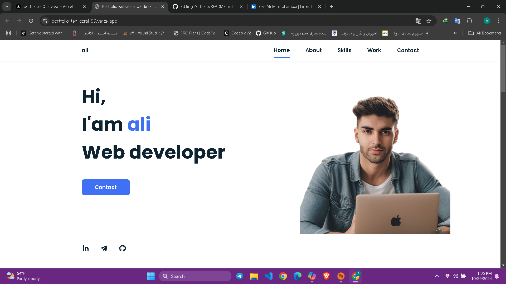

# Portfolio


# Portfolio Website and Side Skills

این پروژه یک وب‌سایت نمونه برای نمایش رزومه و مهارت‌های من است. با استفاده از HTML، CSS و JavaScript ایجاد شده است.

[مشاهده دمو](https://portfolio-ten-coral-99.vercel.app/)



## ویژگی‌ها

- **نمایش رزومه**: اطلاعات شخصی، تجربیات کاری و مهارت‌ها.
- **قابلیت‌های تعاملی**: لینک‌های شبکه‌های اجتماعی و فرم تماس.
- **طراحی ریسپانسیو**: نمایش بهینه در تمامی دستگاه‌ها.

## نصب و راه‌اندازی

فایل index.html را در مرورگر خود باز کنید تا وب‌سایت را مشاهده کنید.

1. **کلون کردن مخزن**:
   ```bash
   git clone https://github.com/your_username/portfolio-website.git
   cd portfolio-website


این پروژه توسط علی میر محمدیه ایجاد شده است.# Portfolio
